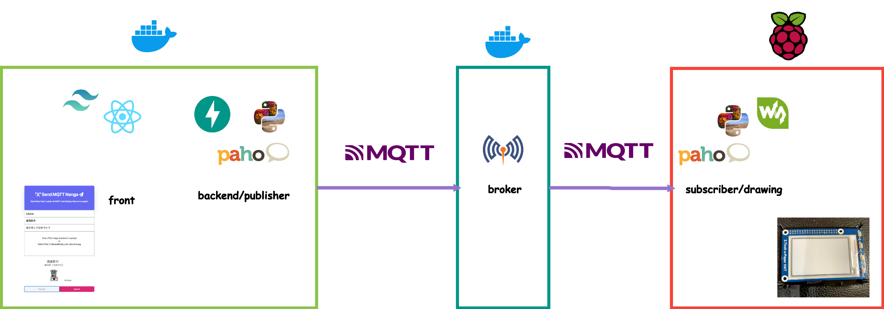
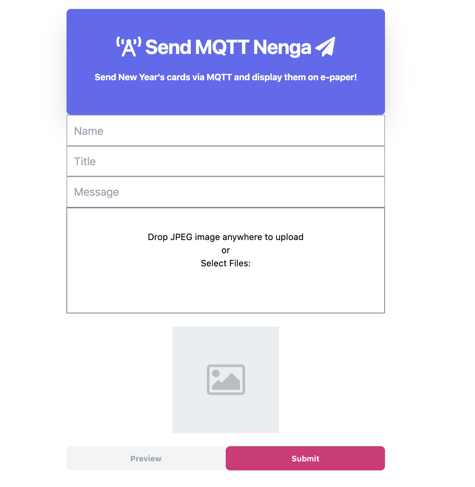
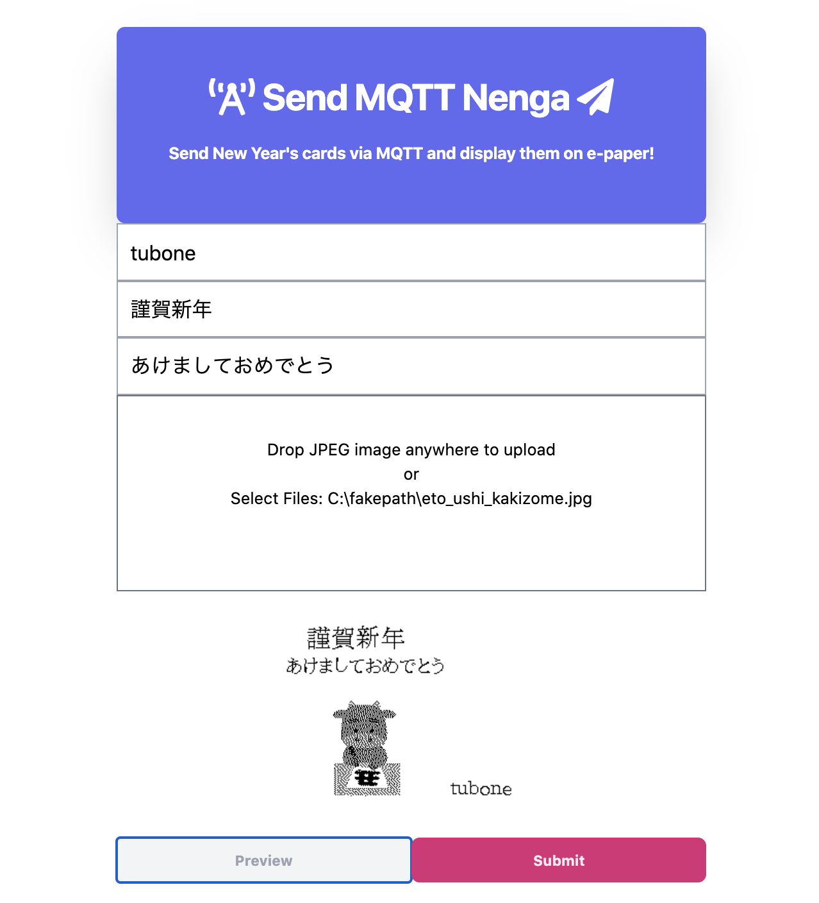

# mqtt-nenga


[](LICENSE)
[](https://github.com/RichardLitt/standard-readme)
[](https://github.com/tubone24/mqtt-nenga/actions?query=workflow%3A.github%2Fworkflows%2Fbuild_image.yml)

> Sending a NENGA (New Year's card) to someone far away... With MQTT

Using MQTT and e-paper, you can send New Year's cards to people far away from your web screen.

Both the MQTT broker and the publisher/web app are created with Docker, so it is easy to build.

## Table of Contents

- [Background](#background)
- [Install](#install)
- [Usage](#usage)
- [License](#license)

## Background

In Japan, there is a culture of sending New Year's greeting cards; such as Nenga-jou(年賀状) to those who have helped us in the past.

However, it takes a lot of time and money to write and send many New Year's cards by mail every year.

So if we can use IoT technology to transfer New Year's cards onto electronic paper, we can at least drop the cost of postcards and stamps.

In addition, the use of MQTT; a lightweight data distribution protocol with a Pub/Sub data distribution model, makes it possible to send New Year's cards to many people one-to-many, 
requiring only a few minutes to create a New Year's card and push the send button.

`mqtt-nenga` has developed as a prototype to provide a solution to the problems that Japanese people face at the end of the year.

### Architecture

It uses React (with (React Hooks)[https://reactjs.org/docs/hooks-intro.html]) as the front-end framework, [Tailwind CSS](https://tailwindcss.com/) as the CSS framework, and calls APIs to the back-end server as SPA.

The backend server also serves as the [MQTT](https://mqtt.org/) publisher, providing APIs to the frontend, as well as front-hosting and creating New Year's card images using [Pillow](https://pillow.readthedocs.io/en/stable/), and publishing to the MQTT broker using [paho](https://www.eclipse.org/paho/index.php?page=clients/python/index.php).

The backend server can be deployed in a Docker container.

The MQTT broker is created in [Eclipse Mosquitto](https://mosquitto.org/), which provides MQTT and Websocket (MQTT over WebSockets) waiting and receiving on port 1883 and port 8080 respectively.

The MQTT broker can also be deployed in a Docker container.

The MQTT subscriber runs on a [Raspberry Pi](https://www.raspberrypi.org/) connected to [Waveshare 2.7-inch e-Paper HAT](https://www.waveshare.com/wiki/2.7inch_e-Paper_HAT), which draws the published image on the e-Paper for the topic specified by the MQTT broker.



## Install

### System Requirements

- Build backend and MQTT broker docker image
  - Make
  - Docker
  - Python 3.7 or more
  - node and npm(over 12.13.0)

- Run backend and MQTT broker
  - Docker
  
- Run subscriber
  - [Raspberry Pi 4 ModelB](https://www.raspberrypi.org/products/raspberry-pi-4-model-b/)
  - [264x176, 2.7inch E-Ink display HAT for Raspberry Pi](https://www.waveshare.com/2.7inch-e-paper-hat.htm)
    - To complete the construction of an environment in which e-paper works, refer to [this page](https://www.waveshare.com/wiki/2.7inch_e-Paper_HAT).
  - Python 3.7 or more

### Preconditions

This tool used by Make, NPM, Python and Docker.

So, Install those apps before run [this tool](https://github.com/tubone24/mac-auto-setup).

### Quick Install

- Docker pull on your environment

```
docker pull docker.pkg.github.com/tubone24/mqtt-nenga/backend:latest

docker pull docker.pkg.github.com/tubone24/mqtt-nenga/mqtt-broker:latest

docker run -d --rm -p 1883:1883 -p 8080:8080 --name mqtt_broker docker.pkg.github.com/tubone24/mqtt-nenga/mqtt-broker

docker run --rm -it -p 8000:8000 -e MQTT_HOST="127.0.0.1" --name mqtt_nenga_backend docker.pkg.github.com/tubone24/mqtt-nenga/backend
```

### Build your environment

- With my [mac-auto-setup](https://github.com/tubone24/mac-auto-setup), you can build the environment you need for your Mac.

- Build front and backend Docker image.

```
make build
```

- Run backend Docker container.
  - If you want to create an MQTT broker on a public server, set environment `MQTT_HOST` to the server hostname or IP address.

```
make run MQTT_HOST="127.0.0.1"
```

- Build and Run MQTT broker
  - You should open port 1883 (MQTT) and port 8080 (WebSocket) on the broker server.

```
make build-broker
make run-broker
```

- Run Subscriber process on Raspberry Pi
  - If you want to create an MQTT broker on a public server, set a first argument `MQTT_HOST` to the server hostname or IP address.
  - We recommend running the backend so that the script will work even if you leave the ssh console.
```
cd backend/src
nohup python sub.py 127.0.0.1 &
```

## Usage

### People who want to send New Year's cards

- Access the Web page. (default <http://localhost:8000/app/index.html>)



- Fill out your name, title, message and drag image.
- Click the `Preview` button to preview the image of the New Year's card you want to send.



- Click `Submit` button to send the New Year's card you create.

### People who receive New Year's cards

- If someone sends you a New Year's card, it will be drawn on the electronic paper for about five seconds.


## License

[MIT © tubone24](LICENSE)